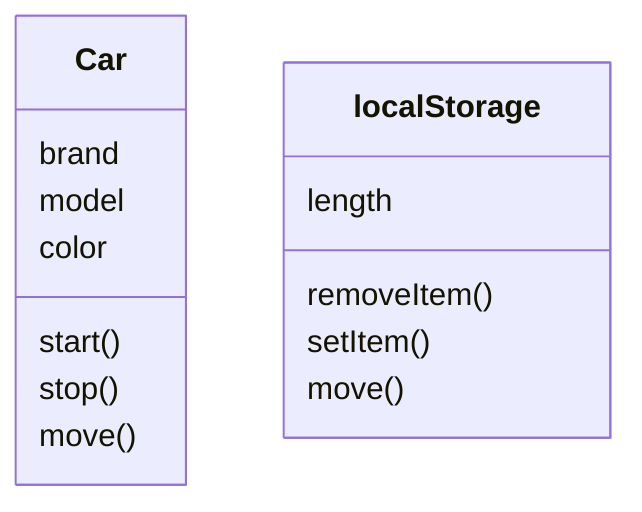
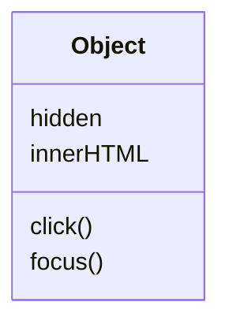

# JS Object Oriented Programming - Part 2

## Getting Started
### 1. What is OOP

- a programming style that is centered around objects and functions
- around since the 70ies
- C#, Java, Ruby, Python, Javascript

### 2. Four Pillars of OOP

Before OOP, Procedural programming
- programs contain functions
- often you have to copy functions manually
- creates a lot of interdependancies, called spaghetti code

OOP unit is object
- variables called properties
- functions called methods



eg. localStorage object in browser
- methods like removeItem, setItem
- properties like length

4 core concepts in OOP
1. encapsulation
2. abstraction
3. inheritance
4. polymorphism

#### Benefits of OOP
1. encapsulation
    - group related variables and functions
    - reduce complexity and increase reusability
2. abstraction
    - reduces complexity and isolate impact of changes
3. inheritance
    - eliminate redundant code
4. polymorphism
    - refactor ugly switch/case statements

#### 1. Encapsulation

- Variables can be modeled as properties of an object, instead of parameter of function.
- "The best functions are those with no parameters!", Uncle Bob - Robert C Martin, author of Clean Code

```javascript
// procedural implementation
// underscore used as numeric separator
let baseSalary = 30_000;
let overtime = 10;
let rate = 20;

function getWage(baseSalary, overtime, rate){ // functions with lots of parameters
    return baseSalary + (overtime * rate)
}
console.log(getWage(baseSalary, overtime, rate));

// OOP alternative
// create employee object
let employee = {
    baseSalary: 30_000, // modeled as properties of object
    overtime: 10,
    rate: 20,
    getWage: function(){  // getWage no parameters
        return this.baseSalary + (this.overtime * this.rate)
    }
};
console.log(employee.getWage());
```

#### 2. Abstraction

- example DVD player, simple buttons PREV, NEXT, PLAY, STOP, internal complexity hidden

Benefits
- simpler interface
- reduce the impact of change (eg. change private method, none of these changes will leak to the outside)

#### 3. Inheritance

- mechanism to eliminate redundant code
- eg. TextBox, Select, CheckBox



#### 4. Polymorphism

- get rid of lots of switch, case code and implement render method in objects

```javascript
switch(element.type){
    case 'select': renderSelect();
    case 'text': renderTextBox();
    case 'checkbox': renderCheckBox();
}

// versus one line of code
element.render();
```

## Objects
### 1. Introduction

- creating objects
- factories and constructors
- primitives and reference types
- working with properties
- getters / setters

Define object as
- object literal {}
- factories
- constructors

### 2. Object Literals

- simplest way to create an object
- use const, let
- don't use var
- not a good way to duplicate objects

```javascript
// object literal syntax {}
const circle = {
    radius: 1,
    location: {
        x: 1,
        y: 1
    },
    draw: function(){
        console.log('draw')l
    }
};
```

### 3. Factories

- create multiple objects with the same structure and behavior
- returns object
- no need to use new operator

```javascript
// Factory Function
function createCircle(radius){
    return {
        radius: radius,
        draw: function(){
            console.log('draw');
        }
    };
}
const circle2 = createCircle(1);
circle2.draw();
```

### 4. Constructors

- create multiple objects with the same structure and behavior
- "this" keyword along with "new" keyword
- similar to creating instance of class (C## / Java)

```javascript
// Constructor Function
// first letter uppercase
function Circle(radius){
    this.radius = radius;
    this.draw = function(){
        console.log('draw');
    }
    // implicit return statement
}
// new operator will 
// - create empty object
// - this points to objects
// - returns object
const another = new Circle(1);
another.draw();
```

### 5. Constructor Property

- every object has constructor property which returns function used to create that object

```javascript
// mostly we use the literals such as on the right
new Object(); // '', "", ``
new Boolean(); // true, false
new Number(); // 1, 2, 3, ...
```

### 6. Functions are Objects

See objects-06.js

### 7. Value vs Reference Types

Value Types (Primitives)
- Number
- String
- Boolean
- Symbol
- undefined
- null

Reference Types (Objects)
- Object
- Function
- Array

Conclusion
- Primitives are copies by their value
- Objects are copies by their reference

### 8. Adding or Removing Properties

- Objects are dynamic, after creation you can create/delete properties.

```javascript
// user.token = 'asdasdsd';
```

### 9. Enumerating Properties

- enumerate all members in object for...in loop
- get all the keys via Object.keys(object)
- "in" operator checks existence of method / property

### 10. Abstraction

- hide the details
- expose/show only essentials
- eg. DVD player only few buttons on the outside
- not everything in your objects should be public

### 11. Private Properties and Methods

- closure concept: have access to variables within the inner function
- define let instead of this... (property)

### 12. Getters and Setters

- to define a getter/setter, use Object.defineProperty

### 13. Cheat Sheet

- see examples/objects.js

### 14. [Exercise Stopwatch](./02-js-oop/exercises/objects-14.js)

## Prototypes
### 1. Inheritance
### 2. Prototypes and Prototypical Inheritance
### 3. Multilevel Inheritance
### 4. Property Descriptors
### 5. Constructor Prototypes
### 6. Prototype vs Instance Members
### 7. Iterating Instance and Prototype Members
### 8. Avoid Extending the Built-in Objects
### 9. Cheat Sheet
### 10. Exercise
### 11. Solution

## Prototypical Inheritance
### 1. Creating Your Own Prototypical Inheritance
### 2. Resetting the Constructor
### 3. Calling the Super Constructor
### 4. Intermediate Function Inheritance
### 5. Method Overriding
### 6. Polymorphism
### 7. When to Use Inheritance
### 8. Mixins
### 9. Cheat Sheet
### 10. Exercise. Prototypical Inheritance
### 11. Solution. Prototypical Inheritance
### 12. Exercise. Polymorphism
### 13. Solution. Polymorphism

## ES6 Classes
### 1. ES6 Classes
### 2. Hoisting
### 3. Static Methods
### 4. The This Keyword
### 5. Private Members Using Symbols
### 6. Private Members Using WeakMaps
### 7. Getters and Setters
### 8. Inheritance
### 9. Method Overriding
### 10. Cheat Sheet
### 11. Exercise
### 12. Solution

## ES6 Tooling
### 1. Modules
### 2. CommonJS Modules
### 3. ES6 Modules
### 4. ES6 Tooling
### 5. Babel
### 6. Webpack
### 7. Cheat Sheet
### 8. What to Learn Next

